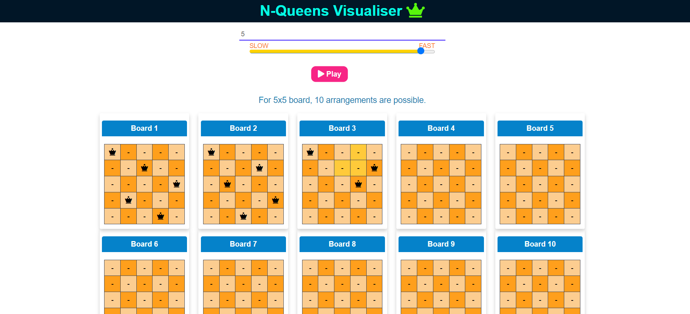

# N-Queen Visualiser

- The N-Queens puzzle is the problem of placing N chess queens on an N×N chessboard so that no two queens threaten each other. Thus, a solution requires that no two queens share the same row, column, or diagonal.

- This algorithm is designed using recursion.

# Description
- Overview: Briefly describe what the N-Queens problem is and the purpose of your visualization project.
- Features: List the main features of your project, such as interactive board, speed control, and multiple solutions display.

